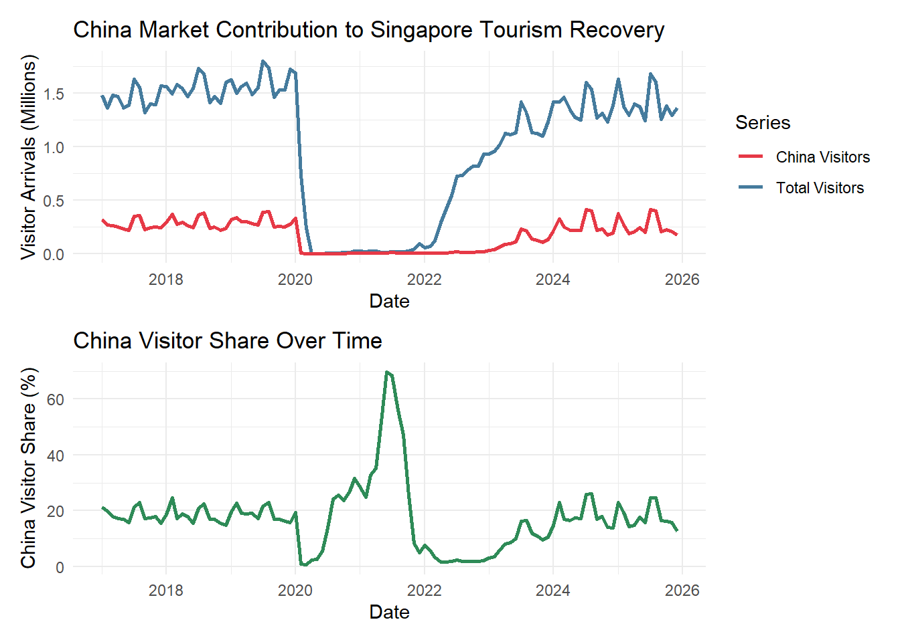
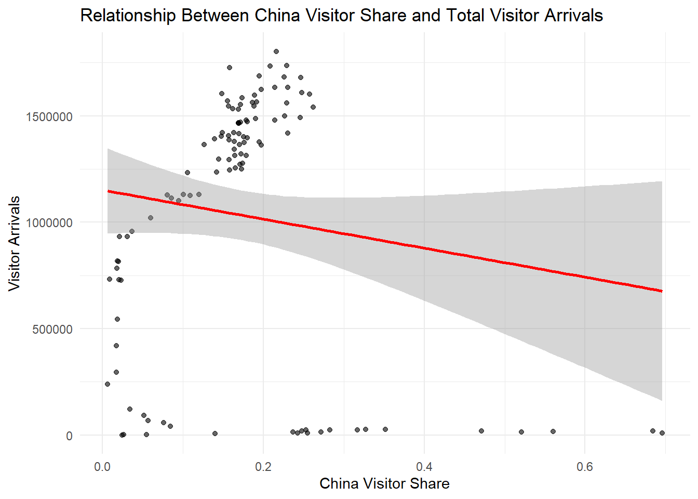
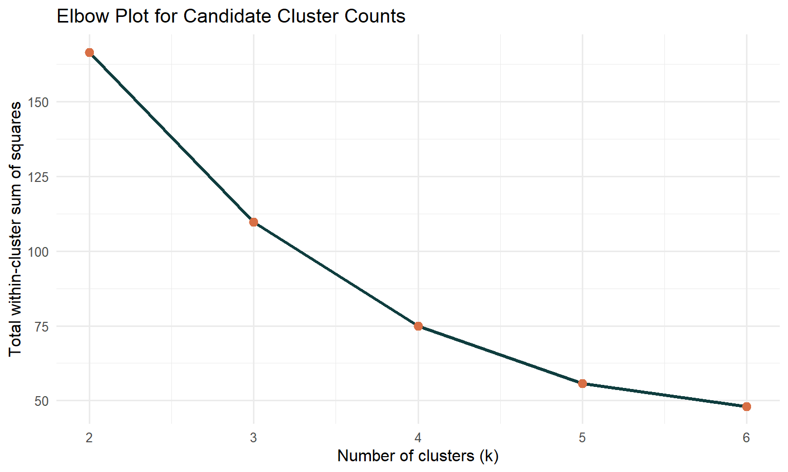
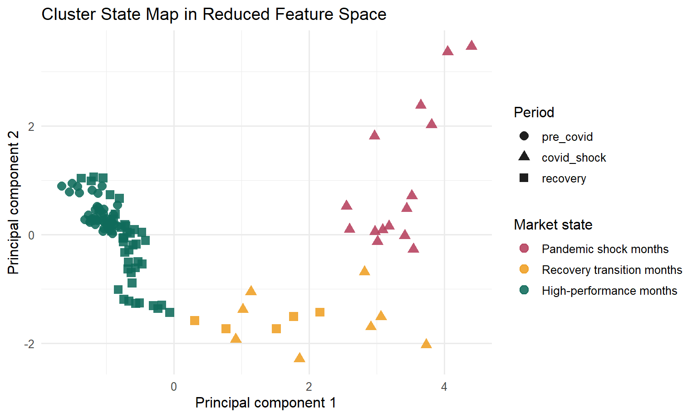
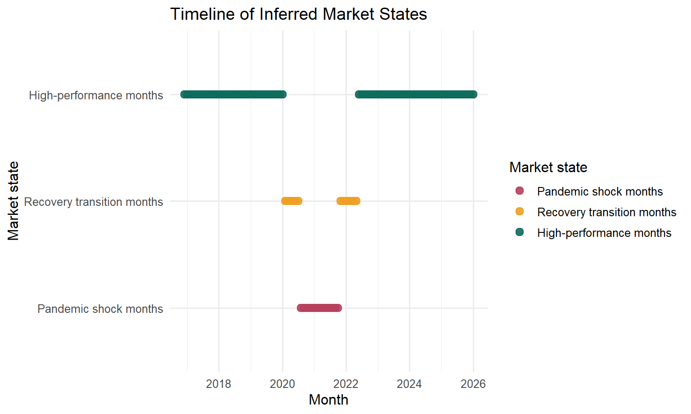

## 1. Overview and Motivation

Singapore's tourism recovery should not be read as a simple question of whether total arrivals have returned to their pre-pandemic level. The monthly tourism record shows a more layered story: visitor arrivals collapsed during the COVID shock, hotel occupancy recovered at a different pace, the Chinese source market did not rebound in exactly the same pattern as total arrivals, and some months behave like distinct market states rather than points on one smooth trajectory.

This proposal draws directly on the team's completed prototype work in [EDA](../prototype/EDA.qmd), [CDA](../prototype/CDA.qmd), and [Clustering](../prototype/module-cluster.qmd). Together, these modules show that Singapore's recovery is best understood as a monthly market-condition problem rather than a traveller-profile problem. The proposed visual analytics application will therefore focus on state changes over time, cross-variable relationships, and interpretable analytical modules that help users explain both disruption and recovery.

## 2. Problem Statement

Public discussion of tourism recovery often reduces the issue to a single volume indicator: whether arrivals are up or down. That framing is too narrow for this project. For Singapore, recovery also involves:

-   shifts in the contribution of the Chinese source market,
-   differences between tourism demand and hotel utilisation,
-   possible structural breaks between pre-COVID, shock, and recovery periods, and
-   the emergence of different tourism market states across months.

Without an integrated visual analytics workflow, these relationships remain fragmented across disconnected charts and summary tables. The project therefore needs a coordinated prototype that combines descriptive views, confirmatory analysis, clustering, and predictive modeling in one coherent interface.

## 3. Project Aim

The project aims to develop a visual analytics prototype that allows users to:

1.  compare tourism conditions across the pre-COVID, COVID shock, and recovery periods;
2.  evaluate how the Chinese source market changed relative to total visitor arrivals;
3.  examine how visitor arrivals, hotel occupancy, and stay duration move together;
4.  group monthly observations into interpretable tourism market states; and
5.  explain hotel occupancy outcomes using rule-based and ensemble models.

## 4. Data and Preparation

The project uses a cleaned monthly tourism workbook sourced from CEIC. The main analytical sheet spans **December 2016 to January 2026** and treats each month as one observation.

### Core monthly variables

-   `date`
-   `visitor_arrivals`
-   `visitor_arrivals_china`
-   `hotel_occ`
-   `avg_stay_monthly`

### Derived monthly variables

-   `china_share`
-   `year`
-   `month`
-   `quarter`
-   `period`
-   `avg_stay_monthly_capped`

### Supplementary contextual variables

-   `spend_per_capita`
-   `tourism_receipts`
-   `avg_stay_annual`

The analytical workflow prioritizes monthly variables because the main research questions focus on tourism market conditions over time. Annual variables are retained as supporting context but are not treated as the core inputs for clustering or occupancy classification.

The project also adopts a period-based interpretation of the timeline:

-   `pre_covid`: December 2016 to January 2020
-   `covid_shock`: February 2020 to December 2021
-   `recovery`: January 2022 to January 2026

## 5. Research Questions

The proposal is guided by four project-level questions:

1.  How did Singapore's tourism market differ across the pre-COVID, COVID shock, and recovery periods?
2.  Did the Chinese source market recover in step with the broader inbound tourism market?
3.  Can monthly observations be grouped into a small number of interpretable tourism market states?
4.  Which indicators are most useful for explaining low, medium, and high hotel occupancy outcomes?

## 6. Analytical Approach

The current proposal is no longer a purely conceptual plan. It is informed by working prototypes that already define the analytical logic of the application.

### 6.1 Exploratory Data Analysis

The exploratory data analysis module provides the descriptive entry point of the proposed visual analytics system. Rather than starting with a predictive model, the project first establishes how the tourism market moved over time and how different indicators changed together. This module is built from interactive time-series charts and relationship plots that help users read the recovery as a sequence of changing monthly conditions instead of a single headline number.

The completed EDA prototype addresses four descriptive questions. First, it shows how total visitor arrivals changed across the pre-COVID, COVID shock, and recovery periods. Second, it compares total arrivals with Chinese arrivals and China's market share. Third, it examines how hotel occupancy responded to changes in tourism demand. Fourth, it checks whether spending behavior moved in the same direction as visitor volume. These views are especially useful at the proposal stage because they define the variables, visual forms, and interactions that the final application should preserve.

One of the clearest findings from the EDA work is that Singapore's recovery cannot be understood through total arrivals alone. The China-focused comparative view shows that Chinese arrivals dropped with the broader market during the disruption period, but their rebound after 2022 lagged behind the recovery in total arrivals. This means that Singapore's tourism recovery was supported by a more diversified mix of source markets rather than a simple restoration of the old demand structure.

{width="78%"}

The EDA prototype also demonstrates that hotel occupancy remains strongly connected to visitor arrivals, but not in a perfectly mechanical way. During the COVID shock period, arrivals collapsed to near zero while hotel occupancy remained above zero, which implies that domestic demand, essential travel, and other non-tourism hotel uses still mattered. In the recovery period, occupancy rose alongside arrivals, making this relationship an important bridge between descriptive analysis and the later occupancy-classification module.

{width="72%"}

From a proposal perspective, this module contributes two design decisions to the final application. First, the app should foreground linked time-series views that let users compare market volume and source-market composition at the same time. Second, the app should retain relationship plots that connect demand indicators to hotel performance, because these visuals help users see why the same month can represent very different tourism conditions even when total arrivals look similar.

### 6.2 Confirmatory Data Analysis

The confirmatory data analysis module extends the EDA findings by asking whether the strongest visual patterns remain meaningful once they are tested more formally. In the current prototype, this section is organized around three questions: whether visitor arrivals differ across historical periods, whether China's visitor share is associated with total arrivals, and whether there is strong month-level seasonality after the most distorted shock years are handled separately.

The current CDA workflow uses a mix of boxplots, ANOVA, regression, and monthly comparison views. This is important for the project because the final Shiny application should not only show users attractive charts; it should also help them distinguish between patterns that are visually striking and patterns that are analytically defensible. In other words, CDA gives the project its evaluation layer.

The prototype results already suggest that period is the most reliable explanatory structure in the dataset. Visitor arrivals clearly differ across the pre-COVID, shock, and recovery periods, which supports the use of period-based filters and period-aware storytelling in the final application. By contrast, the China-share regression view is more cautious: it shows that a higher China share does not automatically translate into higher total arrivals, which means the Chinese market is important but should not be treated as a single dominant driver of overall recovery.

{width="72%"}

This module therefore contributes an important logical safeguard to the proposal. It prevents the final application from making overly simple claims such as "China recovered, therefore tourism recovered" or "seasonality explains the recovery pattern." Instead, the application can use CDA results to frame more disciplined interpretations, where period effects are emphasized, source-market composition is treated carefully, and statistical summaries sit beside visual exploration rather than being replaced by it.

### 6.3 Clustering Analysis

The clustering module, developed from Wang Zhuoran's prototype work, adds a structural layer that neither EDA nor CDA can provide on their own. Instead of asking only whether one variable increased or decreased, it asks whether the monthly observations naturally form a small number of interpretable tourism market states. This is central to the project logic because the unit of analysis is the month, and the core analytical question is whether recovery unfolded through distinct market conditions rather than one smooth trend.

The model uses four standardized monthly indicators: `visitor_arrivals`, `china_share`, `hotel_occ`, and `avg_stay_monthly_capped`. These variables were chosen because together they capture tourism scale, market composition, accommodation performance, and stay behavior. Standardization is necessary so that visitor counts do not dominate the clustering simply because they are measured on a larger numeric scale than the other indicators.

The prototype first evaluates candidate cluster counts using elbow and silhouette diagnostics. This step matters because the goal is not to force an arbitrary number of groups onto the data, but to justify a cluster structure that is both statistically reasonable and substantively interpretable. The diagnostics support selecting `k = 3`, which offers a workable balance between compactness and interpretability.

{width="72%"}

After fitting the final k-means model, the three cluster states can be interpreted as pandemic shock months, recovery transition months, and high-performance months. The reduced-space cluster map shows that these states are not random labels. They occupy different regions of the feature space and align with meaningful differences in arrivals, hotel occupancy, and China's market contribution.

{width="76%"}

The historical timeline view makes the interpretation even more persuasive. Pandemic shock months concentrate inside the disruption period, recovery transition months bridge the early reopening phase, and high-performance months dominate the pre-COVID and later recovery periods. This is exactly the kind of structure the final application should expose to users: not only whether recovery happened, but what kind of market state each month represents.

{width="74%"}

In the final Shiny application, this module will support exploratory state comparison, timeline interpretation, and state-level downloads. It is also an effective bridge between descriptive analysis and model-based explanation, because the inferred states provide a compact summary of how multiple tourism indicators move together over time.

### 6.4 Decision Tree and Random Forest

The decision tree and random forest module focuses on hotel occupancy classification. The goal is to identify which tourism indicators best explain whether a month belongs to a low, medium, or high occupancy state.

The decision tree component emphasizes interpretability by expressing model logic as explicit branching rules. The random forest component strengthens the analysis by testing the same question with a more robust ensemble method, allowing the team to compare predictive stability and variable importance. Together, these methods support both explanation and validation.

{width="75%"}

{width="75%"}

{width="75%"}

## 7. Proposed Visual and Interaction Design

The final prototype is designed as a modular visual analytics system rather than a single static report. The interaction design is built around the analytical work already completed by Xi Zixun and Wang Zhuoran:

-   interactive time-series charts for tracking visitor arrivals and China's market share,
-   scatterplots and boxplots for period comparison and relationship checks,
-   clustering diagnostics such as elbow and silhouette views,
-   state maps and timelines that anchor cluster assignments back to historical months,
-   interactive data tables for cluster profiles and month-level assignments, and
-   model interpretation views for decision tree and random forest outputs.

The Shiny application will expose a focused set of controls, such as period filters, cluster parameters, random seeds, and export functions, so that users can test alternative settings without losing the interpretability of the workflow. The design principle is to keep each module analytically meaningful, visually legible, and easy to compare with the written coursework narrative.

## 8. R Packages

The proposal relies on a set of packages that support data import, transformation, visualization, clustering, and modeling.

| Package | Purpose |
|----|----|
| `readxl` | Import the cleaned Excel workbook and project sheets. |
| `dplyr` | Filter, transform, summarize, and reshape monthly tourism data. |
| `lubridate` | Parse dates and derive time-based fields such as year, month, and quarter. |
| `ggplot2` | Build the core statistical graphics used across all modules. |
| `plotly` | Add interactivity to selected EDA and CDA charts. |
| `patchwork` | Combine multiple `ggplot2` charts into shared analytical views. |
| `GGally` | Support paired visual exploration and relationship checks. |
| `corrplot` | Visualize correlation structures among tourism indicators. |
| `cluster` | Estimate k-means diagnostics and silhouette scores. |
| `DT` | Present interactive tables in the Quarto pages and Shiny application. |
| `rpart` | Train the decision tree classification model. |
| `rpart.plot` | Render readable static decision tree diagrams. |
| `caret` | Standardize model training, evaluation, and confusion-matrix reporting. |
| `ranger` | Fit the random forest classification model efficiently. |
| `visNetwork` | Support interactive tree-style model visualization. |
| `htmlwidgets` | Preserve interactive outputs inside the website. |
| `shiny` | Provide the modular interactive application framework for the final prototype. |
| `bslib` | Support theme control and layout customization in the Shiny interface. |

## 9. Expected Contribution of the Prototype

The proposed system contributes more than a set of charts. It offers a structured way to understand tourism recovery through three linked ideas:

1.  recovery should be compared across historically meaningful periods;
2.  the Chinese source market matters, but it does not fully explain overall tourism performance; and
3.  monthly tourism conditions can be grouped into interpretable states that support both exploration and modeling.

By combining Xi Zixun's descriptive and confirmatory work with Wang Zhuoran's clustering module and the occupancy-classification module, the project moves from a general tourism dashboard toward a more analytical visual system for explaining recovery dynamics in Singapore.
