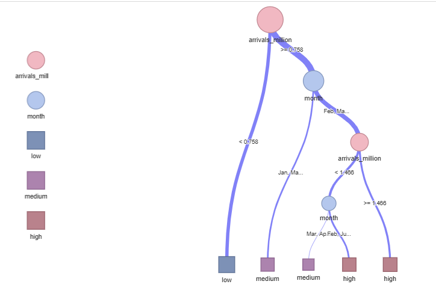
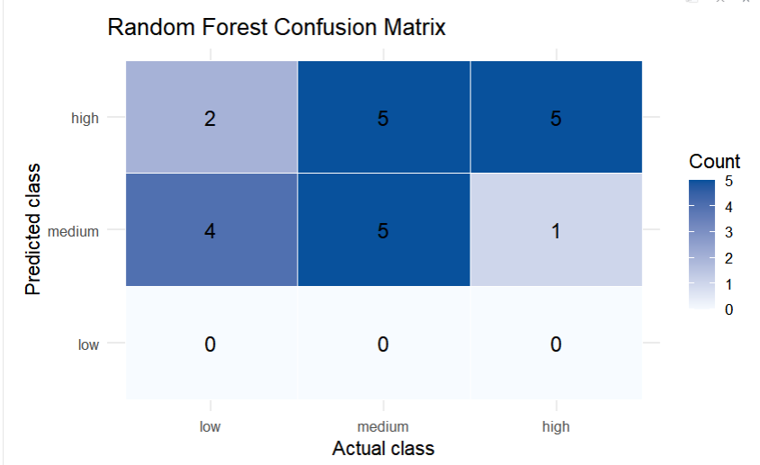
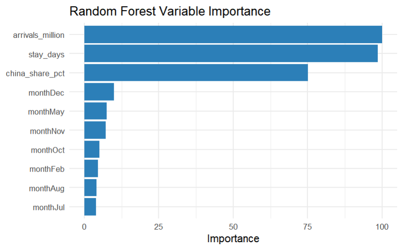

## 1. Overview & Motivation

Singapore’s tourism sector experienced a severe shock during the pandemic and entered an uneven recovery phase in the years that followed. Monthly patterns in visitor arrivals, hotel occupancy, length of stay, and the share of the Chinese source market all suggest distinct recovery stages. Static charts alone are insufficient for users who need to explore these structural shifts from multiple perspectives. This project therefore proposes an interactive visual analytics prototype to help users understand how Singapore’s tourism market moved from pandemic shock toward recovery and high-performance states.

## 2. Problem Statement 

Current discussions on tourism recovery often focus narrowly on whether visitor numbers have returned, without adequately examining market structure, seasonality, or stage-specific differences in recovery. In particular, there is a lack of an interpretable and interactive analytical framework to show how the Chinese source market contributed to Singapore’s overall tourism recovery and whether hotel recovery was mainly driven by total demand volume.

## 3. Project Aim

The project aims to develop a visual analytics prototype based on monthly tourism data, enabling users to understand tourism recovery at descriptive, statistical, and model-based levels. The prototype will integrate exploratory data analysis, confirmatory analysis, clustering, decision tree analysis, and random forest analysis to explain how tourism market states evolve over time.

## 4. The Data

The project data is sourced from the CEIC website and is guaranteed to be reliable in terms of data origin. We selected the following sets of data for our research.

-   Average Length of Stay

-   Hotel Room Occupancy Rate

-   Tourist Expenditure Per Capit

-   Tourism Receipts

-   Average Length of Stay

-   Visitor Arrivals

-   Visitor Arrivals: China

The project uses a cleaned monthly tourism dataset spanning **December 2016 to January 2026**. Core variables include total visitor arrivals, visitor arrivals from China, hotel room occupancy rate, monthly average length of stay, and derived fields such as China’s visitor share, quarter, year, and COVID-stage labels. Annual variables such as tourism receipts and expenditure per capita will be used only as supplementary context rather than as direct inputs for the monthly classification models.

## 5Research Questions

The project focuses on the following questions:

1.  How did Singapore’s tourism market differ across the pre-COVID, shock, and recovery periods?

2.  Did the recovery of the Chinese source market move in tandem with the broader tourism market?

3.  Which factors best determine whether a month falls into a low, medium, or high hotel occupancy state?

4.  Can monthly tourism observations be grouped into meaningful market-state clusters?

## 6. Methodology and Analytical Approach

The project adopts four main analytical modules. First, exploratory analysis will reveal trends, seasonality, and unusual shifts. Second, confirmatory analysis will validate stage differences through correlation analysis, group comparisons, and significance testing. Third, clustering will classify months into interpretable market states such as “pandemic shock,” “recovery transition,” and “high-performance.” Finally, tree-based models, including decision trees and random forests, will identify the main drivers of hotel occupancy levels.

## 7. Decision Tree and Random Forest

The decision tree module emphasizes interpretability by translating complex relationships into clear rules, such as identifying thresholds below which months are likely to fall into low occupancy states. The random forest module serves as a more robust nonlinear classifier for assessing variable importance and testing model stability on unseen data. Together, the two approaches support both explanation and validation. Preliminary prototype testing suggests that total visitor volume is the most stable key variable, while seasonality, length of stay, and China’s visitor share provide additional discriminating power.

{width="75%"} {width="75%"} {width="75%"}

## 8Data Visualisation Methods

The prototype will include time-series line charts, period-based boxplots, correlation heatmaps, cluster scatter plots, cluster profile charts, decision tree visualizations, random forest variable importance plots, confusion-matrix heatmaps, and model-performance-versus-tree-count plots. These visualizations are designed not merely to display results, but to reveal the layered logic, threshold effects, and state transitions underlying tourism recovery.

## 9 R Packages

| **Package** | **Description** |
|:-----------------------------------|:-----------------------------------|
| tidyverse | Used for data cleaning, transformation, filtering, summarisation, and general data manipulation. |
| readxl | Used to import the original Excel dataset into R. |
| lubridate | Used to process date variables and create year, month, and quarter fields. |
| writexl | Used to export cleaned data into Excel format. |
| ggplot2 | Used to create core statistical graphics such as line charts, boxplots, scatterplots, and bar charts. |
| plotly | Used to add interactivity to selected visualisations. |
| DT | Used to display interactive data tables in the prototype. |
| corrplot | Used to visualise correlation matrices among tourism variables. |
| cluster | Used for clustering analysis and cluster quality assessment such as silhouette scores. |
| factoextra | Used to visualise clustering results, elbow plots, and cluster profiles. |
| rpart | Used to build decision tree classification models. |
| rpart.plot | Used to create clear static decision tree visualisations for reporting. |
| visNetwork | Used to create interactive tree visualisations. |
| caret | Used for model training, tuning, resampling, confusion matrix evaluation, and workflow standardisation. |
| ranger | Used to build random forest classification models efficiently. |
| patchwork | Used to combine multiple ggplot charts into one display layout. |
| htmlwidgets | Used to save and render interactive HTML-based outputs. |
| sparkline | Used to support the interactive decision tree visualisation built with visNetwork. |
