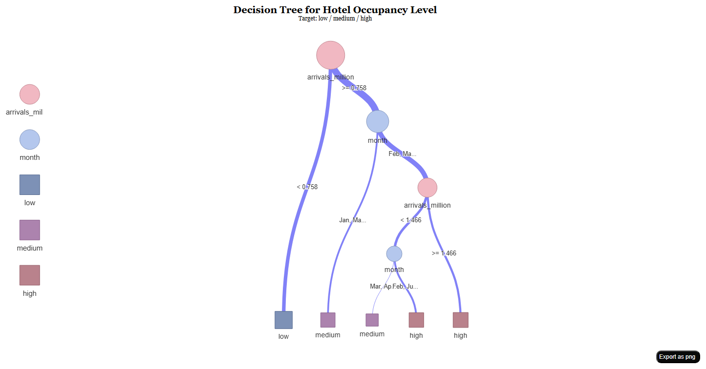

::: {.poster-page}

::: {.poster-hero}

ISSS608 Visual Analytics & Applications

# Singapore Tourism Recovery Through Time-Series Visual Analytics

One integrated workflow for <strong>exploring demand</strong>, <strong>grouping recovery trajectories</strong>, and <strong>forecasting source-market arrivals</strong> using Singapore tourism time series.

  Xi Zixun
  -
  Wang Zhuoran
  -
  Jin Qinhao

  Shared arrivals backbone
  Visual analysis + clustering + forecasting
  Quarto website + modular Shiny app
  Singapore tourism recovery

:::

::: {.poster-top-grid}
::: {.poster-card}
## Why This Project

Singapore tourism did not recover as one uniform curve. Different source markets returned at different speeds, while hotel utilisation and stay behaviour reacted with their own lag. Static totals hide this structure.

We therefore reframed the project as a **time-series decision workflow**:

- reveal turning points and seasonal structure
- group markets with similar recovery paths
- forecast short-term demand while preserving interpretation
:::

::: {.poster-card}
## Shared Data Backbone

The final project uses one coordinated analytical contract:

- **Core series**: monthly visitor arrivals by country
- **Supporting context**: hotel room occupancy, average length of stay, number of hotels, and total room revenue

This keeps the three modules consistent while letting the app explain whether demand recovery translates into wider tourism performance.

  

    
Core target

    
Country arrivals

  

  

    
Support layer

    
Hotel context

  

  

    
Delivery

    
Website + Shiny

  

:::

::: {.poster-card}
## End-to-End Workflow

  
<strong>1. Explore</strong>Read trend, shock, rebound, and seasonality across monthly tourism series.

  
<strong>2. Compare</strong>Place one market against hotel utilisation and stay indicators.

  
<strong>3. Cluster</strong>Group countries with similar recovery trajectories over a shared window.

  
<strong>4. Forecast</strong>Benchmark seasonal naive against ETS and ARIMA for short-term demand prediction.

:::
:::

::: {.poster-section-grid}
::: {.poster-band}

Module 1

## Time Series Explorer

The explorer establishes the narrative baseline: a visible collapse in 2020, staggered reopening, and an uneven return of source-market demand. It also connects demand to hotel utilisation, showing that recovery in arrivals is meaningful only when it moves with broader tourism performance.

- China's contribution shows both the magnitude of the pandemic shock and the asymmetry of the recovery path.
- Hotel occupancy still tracks visitor demand positively, even though the rebound is phased rather than immediate.
- The explorer is the starting point for both clustering and forecasting, because it exposes seasonality before modelling begins.
:::

::: {.poster-card}
::: {.poster-image-grid-2}
::: {.poster-visual}
{alt="China market contribution chart"}

<strong>Demand structure:</strong> China and total arrivals collapse together in 2020, then recover at different speeds.

:::
::: {.poster-visual}
{alt="Hotel utilisation relationship chart"}

<strong>Performance linkage:</strong> higher arrivals generally align with stronger hotel occupancy across recovery phases.

:::
:::
:::
:::

::: {.poster-section-grid}
::: {.poster-band}

Module 2

## Clustering Recovery Trajectories

Clustering moves the project from "what happened" to "which markets behave similarly." Instead of clustering individual months, the final module clusters **country trajectories**, which is more consistent with the shared time-series backbone.

- The reduced-space scatter separates recovery shapes into three clear groups, with a mean silhouette around **0.63**.
- The timeline highlights that the tourism system moved through persistent phases rather than random monthly noise.
- The elbow diagnostic supports a compact solution that is interpretable enough for the Shiny interface.
:::

::: {.poster-card}
::: {.poster-image-grid-3}
::: {.poster-visual}
{alt="Cluster scatter plot"}

<strong>State map:</strong> the three-cluster view separates high-performance, transition, and shock-related patterns.

:::
::: {.poster-visual}
{alt="Cluster timeline"}

<strong>Phase timing:</strong> market-state chronology shows when the system shifted out of the shock period.

:::
::: {.poster-visual}
{alt="Elbow plot"}

<strong>Model selection:</strong> the elbow view keeps the clustering choice transparent rather than arbitrary.

:::
:::
:::
:::

::: {.poster-section-grid}
::: {.poster-band}

Module 3

## Forecasting Source-Market Demand

The forecasting module follows the Chapter 19/20 logic from *R for Visual Analytics*: inspect the time path, check seasonal structure, build a time-aware split, and compare benchmark versus model-based forecasts. The latest implementation also supports a lighter fallback route so the prototype remains runnable in shared environments.

- The selected country series retains strong monthly seasonality after the pandemic shock.
- Decomposition makes the structural break explicit, which helps justify a forecasting workflow instead of a static regression treatment.
- Seasonal Naive, ETS, and ARIMA are compared on the same holdout window so forecast quality remains interpretable.
:::

::: {.poster-card}
::: {.poster-image-grid-3}
::: {.poster-visual}
{alt="Forecast input series"}

<strong>Input series:</strong> China arrivals capture shock, reopening, and renewed seasonal peaks.

:::
::: {.poster-visual}
{alt="Decomposition plot"}

<strong>Diagnostics:</strong> trend, seasonal, and remainder components reveal the structural change before forecasting.

:::
::: {.poster-visual}
{alt="Forecast comparison plot"}

<strong>Holdout comparison:</strong> the forecast pane benchmarks Seasonal Naive, ETS, and ARIMA on the same testing horizon.

:::
:::
:::
:::

::: {.poster-bottom-grid}
::: {.poster-highlight}
## Shiny App Delivery

The final system is not just a report. It is delivered as a coordinated website-plus-Shiny experience:

- the website documents the data contract, prototypes, and usage logic
- the Shiny app exposes explorer, clustering, and forecasting as one flow
- package audit and smoke tests support deployment quality

This is what turns the project from a set of plots into a reusable visual analytics product.
:::

::: {.poster-card}

Archive

## Supplementary Modelling Study

The repository also preserves Jin Qinhao's earlier decision-tree and random-forest work as an archive. It is not part of the final live module contract, but it remains useful as a supplementary modelling reference.

::: {.poster-image-grid-2}
::: {.poster-visual}
{alt="Decision tree archive plot"}

<strong>Decision tree:</strong> a compact rule-based view for hotel occupancy classification.

:::
::: {.poster-visual}
{alt="Random forest importance chart"}

<strong>Random forest:</strong> feature ranking shows how arrivals, stay days, and China share drive the archived classifier.

:::
:::
:::
:::

::: {.poster-footer}
::: {.poster-footer-grid}
::: 
## Key Takeaways

- Tourism recovery is better understood as a time-series system than as a single headline total.
- Country-level arrivals provide one shared backbone that keeps exploration, clustering, and forecasting consistent.
- Hotel occupancy and stay indicators add business meaning by showing whether demand recovery translates into tourism performance.
- The final app is designed to support comparison, explanation, and short-term planning in one workflow.
:::
::: 
## Next Step

- Extend the forecasting panel to more source markets.
- Add deployment-ready public hosting for the Shiny module.
- Turn cluster interpretation into reusable market personas for decision-making.
:::
:::
:::

:::
