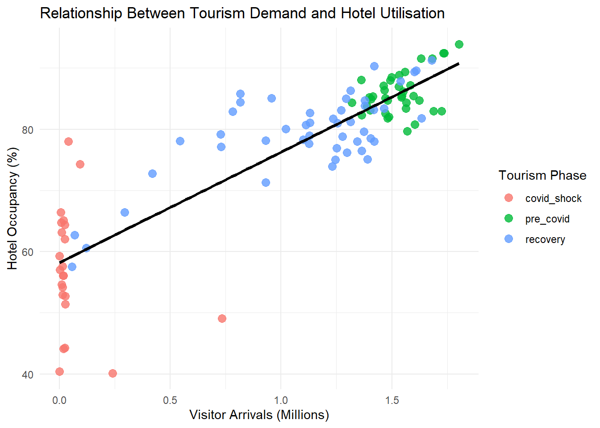

::: {.poster-canvas}

::: {.poster-hero}
::: {.hero-kicker}
ISSS608 Visual Analytics & Applications | Singapore Management University
:::

# Singapore Tourism Recovery Through Time-Series Visual Analytics

## Integrating exploration, clustering, and forecasting on a shared tourism time-series backbone

::: {.hero-meta}
**Team Members**  
Xi Zixun | Wang Zhuoran | Jin Qinhao

**Poster Scope**  
Issues and Problems | Motivation | Approach | Results | Future Work
:::
:::

::: {.poster-grid}

::: {.grid-left}

::: {.section-box .section-problem}
### Issues and Problems

Singapore's tourism recovery cannot be understood well from total visitor counts alone. After the pandemic shock, different source markets returned at different speeds, while hotel occupancy and average stay length reacted with different timing and intensity.

The project addresses three linked problems:

- aggregate visitor totals hide uneven recovery across countries
- decision-makers need clearer recovery patterns, not only raw charts
- short-term planning requires forecasting rather than only descriptive reporting

Because these issues are time-dependent, the project must analyse tourism as a **time-series system** instead of as a static snapshot.
:::

::: {.section-box .section-motivation}
### Motivation

This problem is important because tourism recovery affects hotel utilisation, pricing pressure, and the broader service economy. It is also difficult because:

- the pandemic created a structural break in the data
- reopening did not happen uniformly across source markets
- seasonal patterns resumed unevenly after the shock
- business indicators such as hotel occupancy and stay length do not move in perfect lockstep with arrivals

The motivation of the project is therefore to build a visual workflow that helps users understand **who returned, how they returned, and what that means for tourism performance**.
:::

::: {.section-box .section-approach}
### Approach

The final solution uses one coordinated analytical design.

#### Data backbone
- Monthly visitor arrivals by country

#### Supporting context
- Hotel occupancy
- Average length of stay
- Room revenue

#### Techniques used
1. **Time Series Explorer** to inspect trend, shock, rebound, and seasonal structure
2. **Trajectory Clustering** to group countries with similar recovery paths
3. **Forecasting** to compare Seasonal Naive, ETS, and ARIMA on a time-aware holdout split

#### Delivery
- Quarto website for documentation and prototype pages
- Shiny app for interactive analysis and comparison
:::

::: {.section-box .section-results}
### Results: System Built

The completed system is not only a report. It is a working visual analytics workflow delivered through:

- Quarto project website
- prototype pages
- modular Shiny app

This makes the results reviewable, repeatable, and interactive for end users rather than static-only.
:::

::: {.section-box .section-results}
### Interpretation and Value

The three modules are designed to answer different decision questions, but they also reinforce one another.

- **Explorer** explains where the shock and rebound occurred.
- **Clustering** shows which source markets behaved similarly through recovery.
- **Forecasting** translates those patterns into short-term planning support.

This layered design makes the poster stronger than a chart collection because each section contributes a different level of interpretation: description, grouping, and projection.

For tourism planners, the most practical takeaway is that country-level arrivals are not only descriptive indicators. They are useful signals for monitoring recovery strength, identifying comparable markets, and anticipating near-term demand pressure on hotels and tourism services.
:::

:::

::: {.grid-center}

::: {.section-box .section-results}
### Results: Time Series Explorer

The explorer establishes the main recovery narrative before modelling begins.

#### Main findings
- China and total arrivals collapse together during the pandemic shock.
- Recovery is visible but not fully symmetric with the pre-2020 pattern.
- Hotel occupancy remains positively linked to arrivals, so visitor recovery still matters operationally.

::: {.figure-frame}

*Country-level demand and total arrivals recover at different speeds rather than following one shared rebound path.*
:::

::: {.figure-frame}

*Recovery in arrivals is reflected in accommodation utilisation, giving business meaning to the time-series signal.*
:::
:::

::: {.section-box .section-results}
### Results: Clustering Recovery Patterns

Clustering changes the question from "what happened overall" to "which countries behave similarly over time."

#### Main findings
- Countries naturally separate into interpretable recovery groups.
- The cluster timeline shows a progression from shock-related patterns to recovery-oriented behaviour.
- The elbow diagnostic supports a compact cluster structure that remains explainable to app users.

::: {.two-up}
::: {.figure-frame}

*The reduced-space view reveals clear grouping among recovery trajectories.*
:::

::: {.figure-frame}

*The timeline view shows when the tourism system exits the shock regime and enters recovery phases.*
:::
:::

::: {.figure-frame .figure-compact}

*The cluster-count diagnostic keeps the grouping choice transparent instead of arbitrary.*
:::
:::

:::

::: {.grid-right}

::: {.section-box .section-results}
### Results: Forecasting Source-Market Demand

Forecasting follows the Chapter 19 and Chapter 20 workflow from *R for Visual Analytics*: inspect the series, check decomposition, make a time-aware split, benchmark models, and evaluate holdout performance.

#### Main findings
- The selected source market keeps strong seasonal structure after the shock period.
- Decomposition makes the structural break explicit before forecasting starts.
- Seasonal Naive, ETS, and ARIMA can be compared on one shared horizon for transparent evaluation.

::: {.figure-frame}

*The input series preserves the pandemic shock, reopening phase, and renewed seasonal peaks.*
:::

::: {.figure-frame}

*Trend, seasonality, and residual components are separated before model comparison.*
:::

::: {.figure-frame}

*A shared holdout window makes benchmark and model-based forecasts directly comparable.*
:::
:::

::: {.section-box .section-future}
### Future Work

- extend forecasting to additional source markets and transport modes
- deploy the Shiny app to a public host for wider access
- translate cluster outputs into reusable market personas
- add more business-side indicators for pricing and utilisation decisions
:::

::: {.section-box .section-results}
### Poster Reading Guide

This poster is intended to be read from left to right:

1. **Problem and motivation** explain why aggregate totals are insufficient.
2. **Approach** defines the shared data backbone and the three-module workflow.
3. **Results** demonstrate how exploration, clustering, and forecasting each add a different layer of evidence.
4. **Future work** shows how the current system can be extended into a fuller decision-support tool.

By arranging the poster this way, the visual evidence and narrative evidence remain aligned, which helps the audience understand both the analytical process and the value of the final system.
:::

:::

:::

::: {.poster-footer}
::: {.footer-box}
**Problem Focus**  
Uneven tourism recovery across countries and its implications for tourism performance
:::

::: {.footer-box}
**Methods**  
Time-series exploration | clustering | forecasting benchmark comparison
:::

::: {.footer-box}
**System Output**  
High-resolution website poster plus an interactive Shiny analytics workflow
:::
:::

:::
