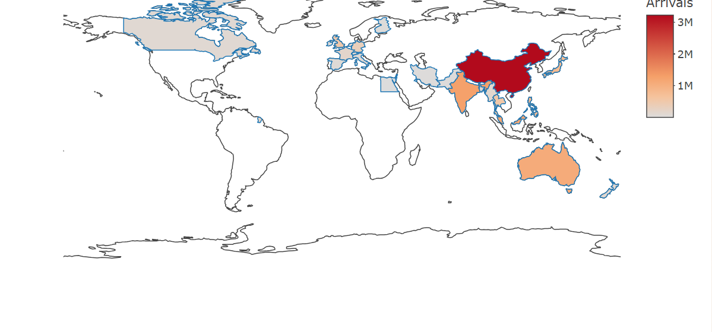
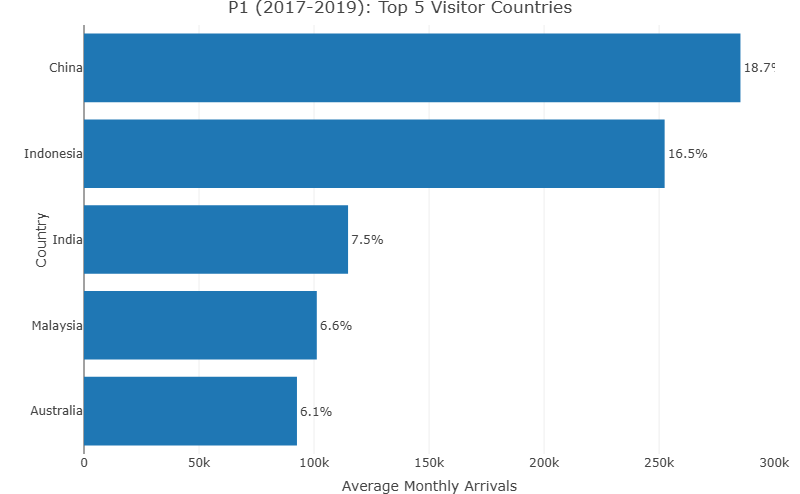
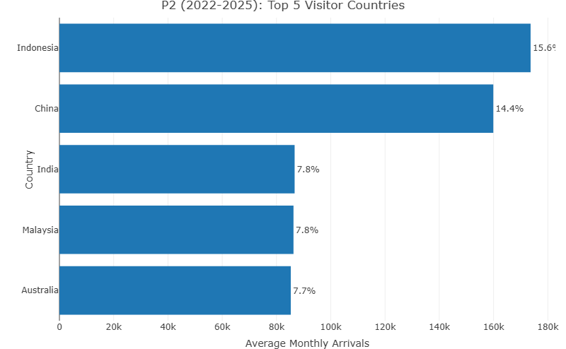
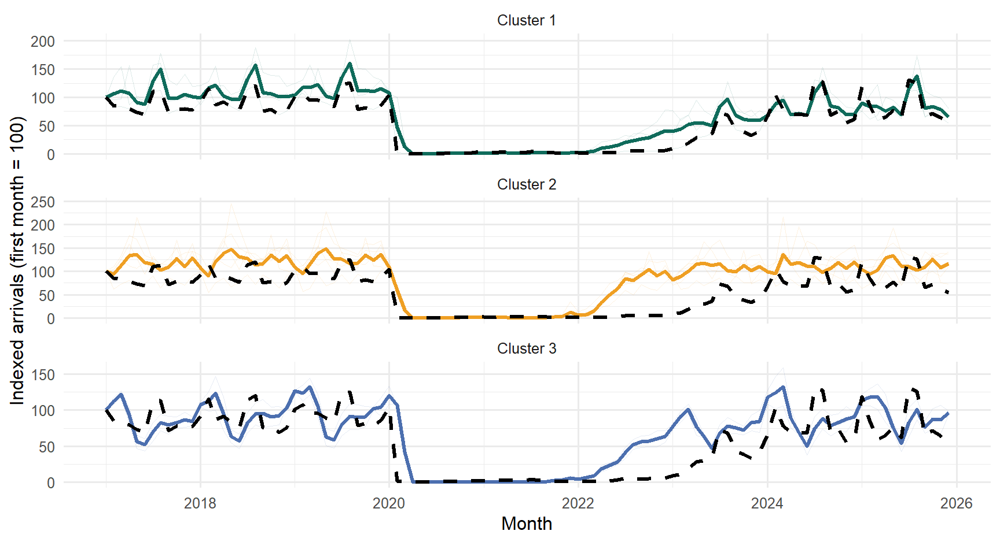
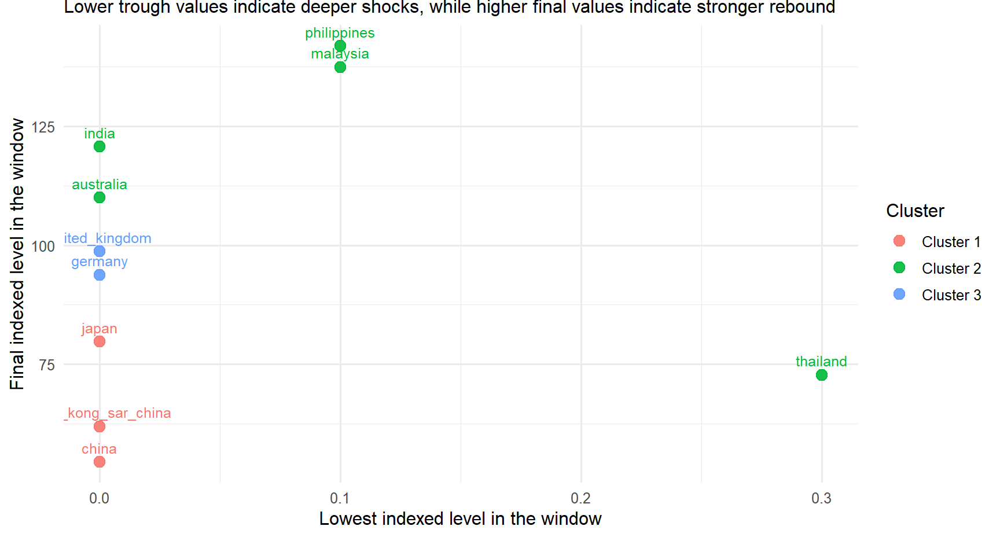
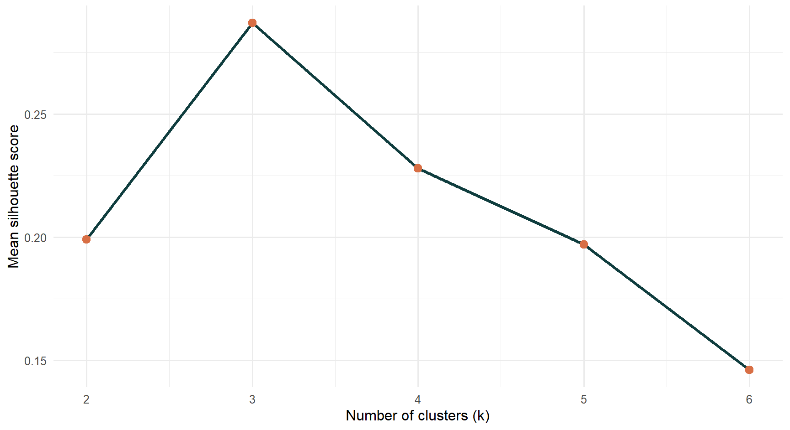
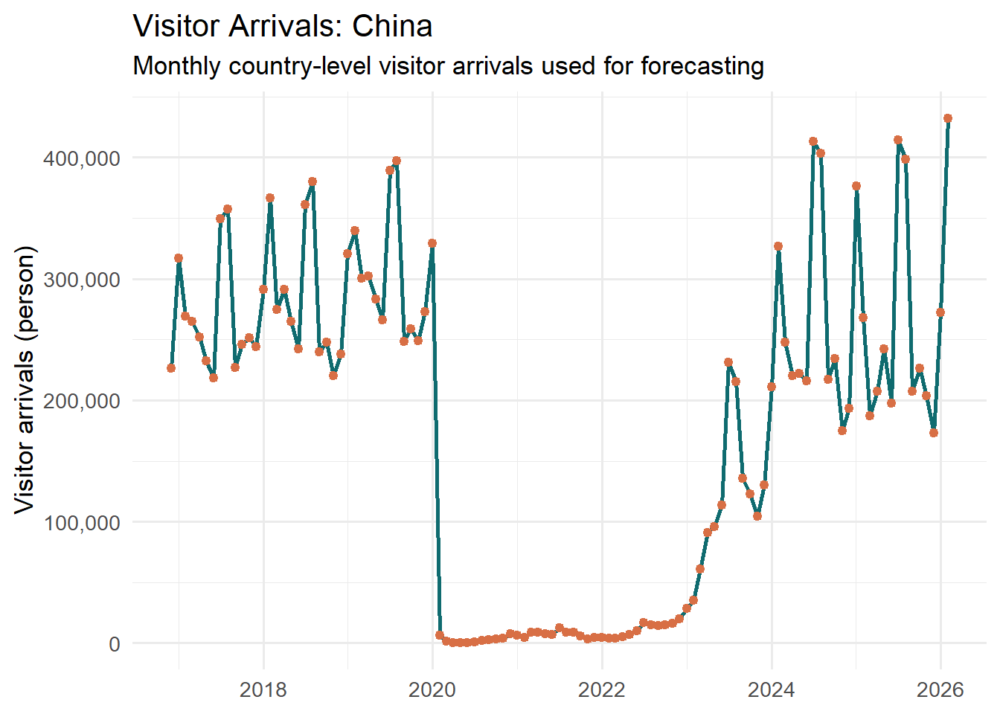
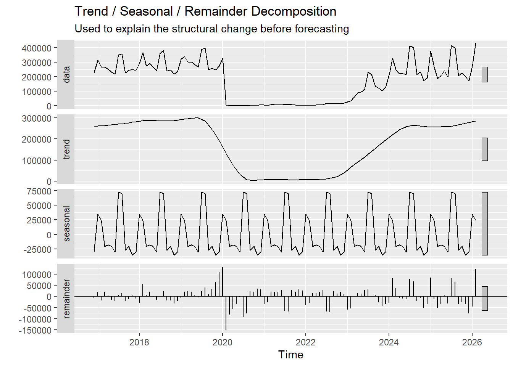
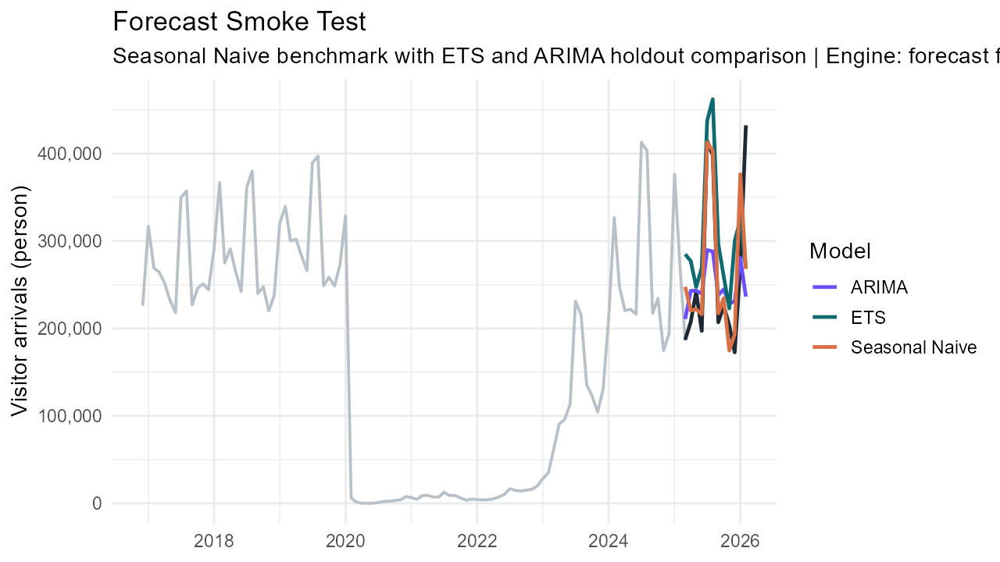

::: {.poster-canvas}

::: {.poster-hero}
::: {.hero-kicker}
ISSS608 Visual Analytics & Applications | Singapore Management University
:::

# Singapore Tourism Recovery Through Time-Series Visual Analytics

## Integrating exploration, clustering, and forecasting on a shared tourism time-series backbone

::: {.hero-meta}
**Team Members**  
Xi Zixun | Wang Zhuoran | Jin Qinhao

**Poster Scope**  
Issues and Problems | Motivation | Approach | Results | Future Work
:::
:::

::: {.poster-grid}

::: {.grid-left}

::: {.section-box .section-problem}
### Issues and Problems

Aggregate visitor counts hide differences in source-market recovery because countries returned with different amplitudes, different seasonal rhythms, and different post-shock trajectories. The pandemic introduced a structural break into the monthly series, and the recovery that followed was uneven across countries. A useful decision system therefore needs to separate market structure, recovery pattern, and forward demand signal within one consistent time-series framework.
:::

::: {.section-box .section-motivation}
### Motivation

Tourism recovery affects hotel utilisation, pricing pressure, and demand planning across the service economy. The analytical challenge comes from three sources at the same time: the structural break created by COVID, the unequal speed of reopening across major source markets, and the return of seasonality after the shock. Business indicators such as occupancy, stay length, and room revenue also respond with different timing, so the project needs a workflow that can connect arrivals, recovery strength, and near-term planning in one visual system.
:::

::: {.section-box .section-approach}
### Approach

The final solution uses one coordinated analytical design built on monthly visitor arrivals by country. Supporting tourism indicators such as hotel occupancy, average length of stay, and room revenue remain available as contextual signals for operational interpretation. The analytical workflow begins with a time-series explorer that reveals trend, shock, rebound, and seasonality, then moves into trajectory clustering to group countries with similar recovery paths, and ends with forecasting to compare Seasonal Naive, ETS, and ARIMA under a time-aware holdout split. The full system is delivered through a Quarto website for documentation and prototype reporting, together with a Shiny application for interactive analysis.
:::

::: {.section-box .section-results}
### Results: System Built

The completed system is a working visual analytics workflow delivered through a Quarto website, a set of prototype pages, and a modular Shiny application. This delivery format makes the analysis reviewable, repeatable, and interactive, while keeping the full methodological chain visible from source data to final interpretation.
:::

::: {.section-box .section-results}
### Interpretation and Value

The three modules answer different decision questions and reinforce one another through a common data backbone. The explorer reveals where the shock was deepest and how market structure changed. The clustering module identifies groups of countries with similar recovery trajectories. The forecasting module turns these recovery signals into short-term planning evidence. Country-level arrivals therefore function as operational indicators for recovery strength, market comparability, and near-term tourism demand.
:::

:::

::: {.grid-center}

::: {.section-box .section-results}
### Results: Time Series Explorer

The explorer establishes the main recovery narrative before modelling begins.

The visual analysis shows that Singapore's visitor market remains concentrated in a small group of major source countries, with strong weight in the Asia-Pacific region. China, Indonesia, India, Malaysia, and Australia define the core portfolio across both windows. The ordering changes after the shock, because Indonesia rises above China in the recovery period while India, Malaysia, and Australia remain close together. This distribution shows that the market portfolio recovered with structural continuity, while the balance between the largest markets shifted during the recovery phase.

::: {.figure-frame}

*Visitor arrivals remain concentrated in Asia-Pacific markets, and the largest contributions come from a small set of source countries with a visibly uneven global distribution.*
:::

::: {.two-up}
::: {.figure-frame}

*Pre-COVID arrivals were led by China and Indonesia, followed by India, Malaysia, and Australia, which together formed the main source-market portfolio.*
:::

::: {.figure-frame}

*The recovery-period ranking places Indonesia first and China second, while India, Malaysia, and Australia remain in the leading group with closer volumes.*
:::
:::
:::

::: {.section-box .section-results}
### Results: Clustering Recovery Patterns

Clustering changes the question from "what happened overall" to "which countries behave similarly over time."

The clustering module groups countries by normalized recovery trajectory, so the unit of analysis is a country time series. The resulting structure reveals three interpretable recovery profiles with different trough depths, rebound strength, and end-of-window levels. This grouping supports comparison by recovery shape, shock depth, and market size within one view.

::: {.two-up}
::: {.figure-frame}

*Representative trajectories reveal distinct recovery profiles with different seasonal rebound amplitudes and different end-of-window positions.*
:::

::: {.figure-frame}

*The recovery position map separates shock depth from final recovery level, which clarifies which markets remain delayed and which markets rebound more strongly.*
:::
:::

::: {.figure-frame .figure-compact}

*The silhouette diagnostic supports a compact three-cluster solution with interpretable separation.*
:::
:::

:::

::: {.grid-right}

::: {.section-box .section-results}
### Results: Forecasting Source-Market Demand

Forecasting follows the Chapter 19 and Chapter 20 workflow from *R for Visual Analytics*. The selected source-market series retains clear seasonality after the shock period, decomposition exposes the structural break before model fitting, and a shared holdout window allows Seasonal Naive, ETS, and ARIMA to be compared on the same horizon.

::: {.figure-frame}

*The input series preserves the pandemic shock, reopening phase, and renewed seasonal peaks.*
:::

::: {.figure-frame}

*Trend, seasonality, and residual components are separated before model comparison.*
:::

::: {.figure-frame}

*A shared holdout window makes benchmark and model-based forecasts directly comparable.*
:::
:::

::: {.section-box .section-future}
### Future Work

Future development will extend forecasting to additional source markets and transport modes, publish the Shiny app on a public host, translate cluster outputs into reusable market personas, and integrate more business-side indicators for pricing and utilisation decisions.
:::

::: {.section-box .section-results}
### Poster Reading Guide

This poster reads from left to right. The first column introduces the problem context, motivation, and system architecture. The center column shows the exploratory and clustering evidence that explains market structure and recovery pattern. The right column shows the forecasting evidence and the remaining development path. This arrangement keeps the analytical sequence visible from description to grouping and then to projection.
:::

:::

:::

::: {.poster-footer}
::: {.footer-box}
**Problem Focus**  
Uneven tourism recovery across countries and its implications for tourism performance
:::

::: {.footer-box}
**Methods**  
Time-series exploration | clustering | forecasting benchmark comparison
:::

::: {.footer-box}
**System Output**  
High-resolution website poster plus an interactive Shiny analytics workflow
:::
:::

:::
