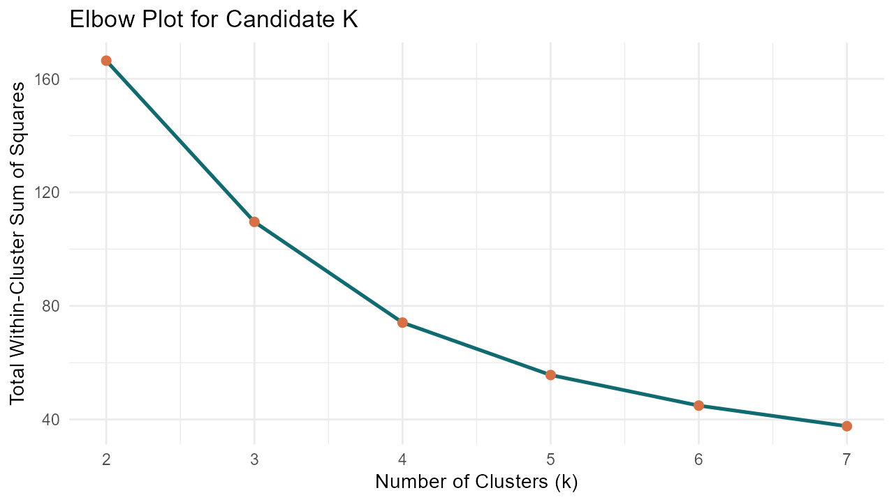
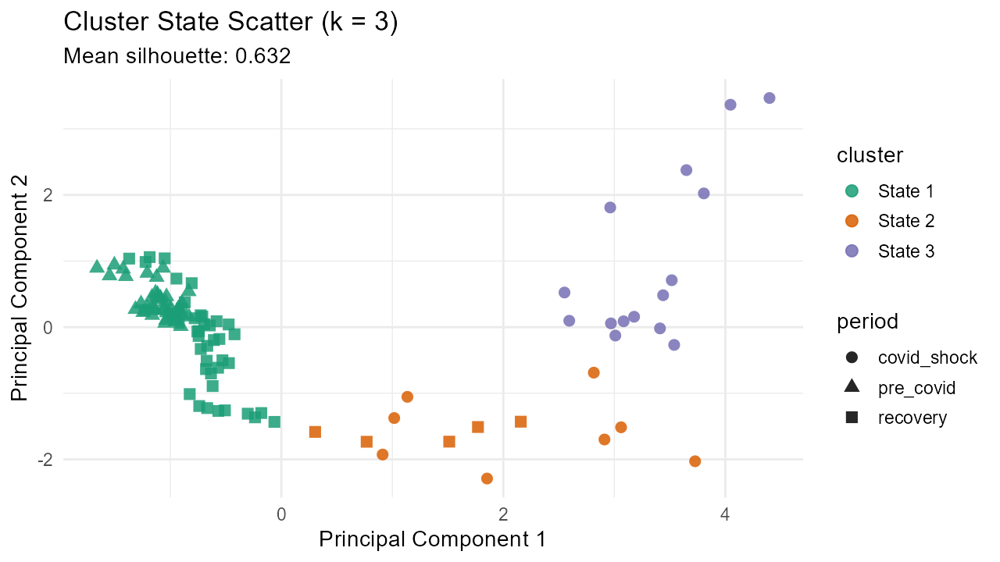

## Submission Scope

This page is structured as an individual **Take-home Exercise 2** submission and focuses on one prototype module:

**Selected module:** `Cluster Analysis` for monthly tourism market states.

The module uses monthly observations to identify interpretable tourism states:

1. Pandemic shock months.
2. Recovery transition months.
3. High-performance months.

## 1. Data Preparation Process

Data preparation follows the imported bilingual plan and detailed cleaning notes in `data/references/`.

Key preparation decisions:

1. Remove metadata rows and invalid `2015-12-01` record.
2. Use monthly variables for model features.
3. Keep annual variables only for supplementary visual context.
4. Create `china_share`, `period`, and calendar fields (`year`, `month`, `quarter`).
5. Use capped stay-length and z-score fields for stable clustering.

## 2. Package Support (CRAN)

The module package audit is documented in [Package Audit](./prototype/package-audit.html).

Core stack for this prototype:

| Package | Purpose | CRAN |
|---|---|---|
| `shiny` | UI/server runtime | Yes |
| `readxl` | Load `.xlsx` data | Yes |
| `dplyr` | Data wrangling | Yes |
| `ggplot2` | Visual outputs | Yes |
| `cluster` | Silhouette scoring | Yes |
| `DT` | Interactive result table | Yes |

## 3. Prototype Code Test and Expected Visual Output

Smoke-test script: `scripts/prototype_smoke_test.R`

Generated outputs:

1. Elbow curve for candidate K.
2. Cluster-state scatter visualization.
3. Cluster profile table.

## 4. Exposed Parameters and Outputs

| Type | Item | Description |
|---|---|---|
| Input | `period_filter` | Filter period: pre-COVID, shock, recovery |
| Input | `k_value` | Number of clusters (`2`-`6`) |
| Input | `scale_features` | Enable/disable z-score standardization |
| Input | `random_seed` | Reproducible k-means assignment |
| Output | Cluster scatter plot | 2D visual state map |
| Output | Cluster profile table | Mean values by cluster |
| Output | Silhouette score | Quick quality indicator |

## 5. UI Design

UI design principles in this prototype:

1. **Progressive disclosure:** show defaults first, advanced controls optional.
2. **Interpretability-first:** output labels use domain terms, not only model terms.
3. **Comparability:** consistent color mapping between plot and table.

Detailed storyboard and component mapping are provided at [UI Storyboard](./prototype/ui-storyboard.html).

## 6. Visual Design & Interactivity Practices

This prototype applies:

1. Clear visual hierarchy for decision steps.
2. Explicit mapping between controls and outputs.
3. Responsive layout for laptop and mobile viewport.
4. Data-informed defaults to reduce trial-and-error.

## 7. Current Status and Next Step

Completed:

1. Modular app skeleton.
2. Data integration and smoke-test artifacts.
3. Quarto write-up scaffold aligned to assignment requirements.

Next:

1. Add confirmatory stats module.
2. Add decision-tree module with feature importance panel.
3. Add deployment pipeline for GitHub Pages + hosted Shiny endpoint.
