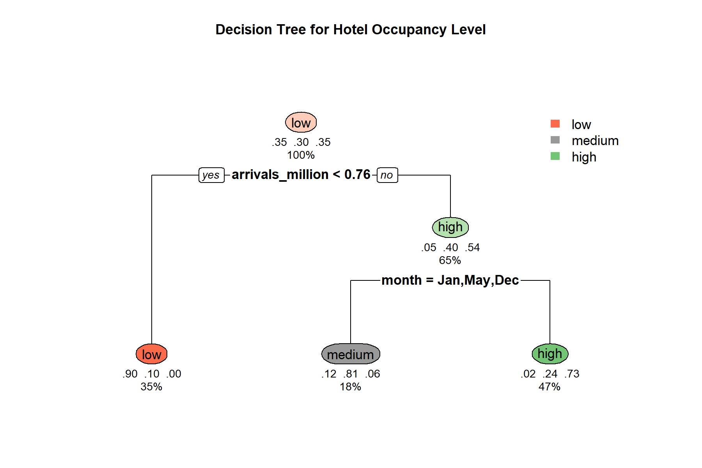
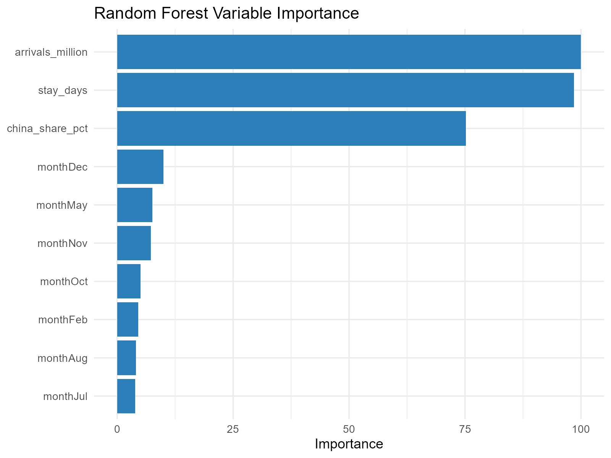

# Submission Scope

This take-home exercise documents my prototype contribution for the tourism recovery visual analytics project.  
The selected prototype focuses on **classification tree** and **random forest** analysis for monthly hotel occupancy classification.

The prototype covers four linked tasks:

1. preparing monthly tourism data for modeling,
2. building an interpretable classification tree,
3. evaluating a random forest benchmark,
4. packaging the outputs into a deployable Shiny application.

# 1. Data Preparation

## Input Data

The original workbook used for my analysis has been moved into the project data area:

- `data/raw/Name your insight (2).xlsx`

Derived datasets and exported tables are stored in:

- `artifacts/tables/`

## Preparation Logic

The preparation process follows the same workflow used in my individual prototype:

1. Read monthly tourism indicators from the Excel workbook.
2. Remove incomplete rows and retain valid monthly observations.
3. Create calendar fields such as `year`, `month`, and `quarter`.
4. Create the recovery-stage field `period`.
5. Derive `china_share` and `china_share_pct`.
6. Cap extreme stay values to stabilize modeling.
7. Create occupancy classes:
   - `low`
   - `medium`
   - `high`
8. Split the data into `train` and `test`.

## Scripts Used

The original scripts from my take-home work have been moved into the root project script folder:

- [scripts/tourism_data_prep_rstudio.R](scripts/tourism_data_prep_rstudio.R)
- [scripts/tourism_decision_tree_rstudio.R](scripts/tourism_decision_tree_rstudio.R)

## Exported Tables

Prepared data and model-ready tables are now stored in the shared artifact location:

- [artifacts/tables/tourism_monthly_clean.csv](artifacts/tables/tourism_monthly_clean.csv)
- [artifacts/tables/tourism_decision_tree_ready.csv](artifacts/tables/tourism_decision_tree_ready.csv)
- [artifacts/tables/tourism_four_part_analysis_ready.csv](artifacts/tables/tourism_four_part_analysis_ready.csv)
- [artifacts/tables/tourism_four_part_analysis_ready.xlsx](artifacts/tables/tourism_four_part_analysis_ready.xlsx)

# 2. Classification Tree Prototype

## Modeling Goal

The classification tree predicts the hotel occupancy category:

- `low`
- `medium`
- `high`

using the following explanatory variables:

- visitor arrivals,
- China share,
- capped stay length,
- month.

## Why This Method Fits the Project

The classification tree is useful because it provides:

1. clear split rules,
2. interpretable structure,
3. easy classroom presentation value,
4. direct comparison with the random forest model.

## Core Outputs

The exported classification tree outputs have been moved into the shared artifacts structure.

### Visual outputs

- [artifacts/plots/decision_tree_plot.png](artifacts/plots/decision_tree_plot.png)
- [artifacts/plots/decision_tree_static.png](artifacts/plots/decision_tree_static.png)
- [artifacts/plots/decision_tree_visual.html](artifacts/plots/decision_tree_visual.html)



### Tables

- [artifacts/tables/decision_tree_metrics.csv](artifacts/tables/decision_tree_metrics.csv)
- [artifacts/tables/decision_tree_confusion_matrix.csv](artifacts/tables/decision_tree_confusion_matrix.csv)
- [artifacts/tables/decision_tree_test_predictions.csv](artifacts/tables/decision_tree_test_predictions.csv)
- [artifacts/tables/decision_tree_variable_importance.csv](artifacts/tables/decision_tree_variable_importance.csv)

## Interpretation Focus

This prototype uses the tree model primarily as an **interpretability-first model**:

1. to show which variables split the occupancy classes,
2. to explain why some months are grouped into low, medium, or high occupancy,
3. to provide a presentation-friendly structure before introducing the random forest.

# 3. Random Forest Prototype

## Modeling Goal

The random forest uses the same predictors as the classification tree, but emphasizes predictive stability and stronger benchmark performance.

## Why This Method Fits the Project

The random forest is used because it can:

1. reduce single-tree instability,
2. provide variable importance ranking,
3. support model comparison against the classification tree,
4. show out-of-bag performance trends.

## Core Outputs

### Visual outputs

- [artifacts/plots/random_forest_importance.png](artifacts/plots/random_forest_importance.png)
- [artifacts/plots/random_forest_oob_accuracy.png](artifacts/plots/random_forest_oob_accuracy.png)
- [artifacts/plots/random_forest_actual_vs_predicted.png](artifacts/plots/random_forest_actual_vs_predicted.png)
- [artifacts/plots/random_forest_confusion_heatmap.png](artifacts/plots/random_forest_confusion_heatmap.png)



### Tables

- [artifacts/tables/random_forest_metrics.csv](artifacts/tables/random_forest_metrics.csv)
- [artifacts/tables/random_forest_confusion_matrix.csv](artifacts/tables/random_forest_confusion_matrix.csv)
- [artifacts/tables/random_forest_oob_accuracy.csv](artifacts/tables/random_forest_oob_accuracy.csv)
- [artifacts/tables/random_forest_test_predictions.csv](artifacts/tables/random_forest_test_predictions.csv)
- [artifacts/tables/random_forest_variable_importance.csv](artifacts/tables/random_forest_variable_importance.csv)

# 4. Shiny Deployment

## Deployment Arrangement

The final Shiny app is now deployed in the repository as a self-contained app bundle:

- [shiny/app.R](shiny/app.R)

The app bundle keeps:

1. `app.R`
2. `data/`
3. `outputs/`
4. `README.md`

together so the app can run directly after cloning the repository.

## Launch Method

The repository-level startup command remains:

```r
Rscript run_app.R 3838
```

and it now opens the deployed final Shiny app through the root app launcher.

# 5. UI and Interaction Design

The deployed Shiny application includes:

1. a data exploration page for trend interpretation,
2. a classification tree page for interpretable rule-based explanation,
3. a random forest page for predictive benchmarking,
4. model comparison summaries.

Key interface features include:

- metric selection,
- date filtering,
- tree tuning controls,
- forest tuning controls,
- visual tabs,
- metric cards,
- prediction comparison charts.

# 6. Current Status

Completed:

1. moved the take-home scripts into the shared `scripts/` folder,
2. moved model outputs into `artifacts/plots` and `artifacts/tables`,
3. deployed the final Shiny app in the repository,
4. aligned the app launch entry point with the deployed app.

This root-level structure now follows the README more closely than storing the complete work only inside `team/jin-qinhao/Take-Home-Exercise2/`.
