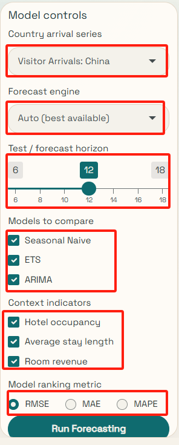
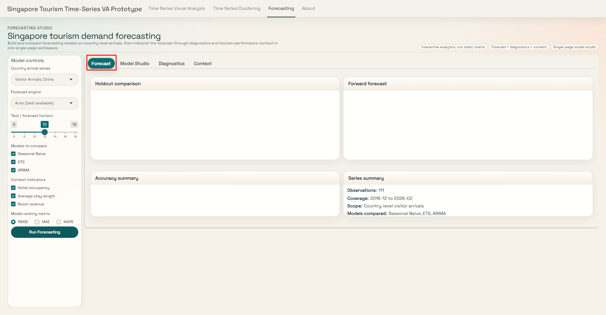
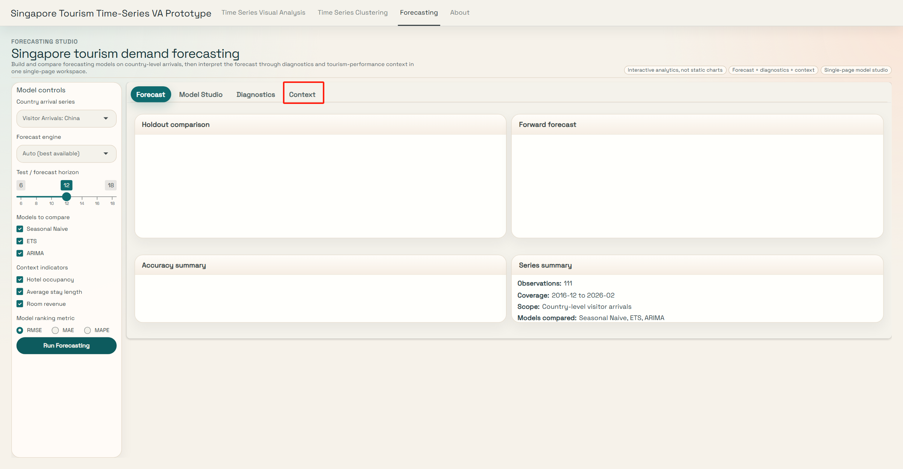

# Forecasting Module User Guide

This Markdown guide explains **how to use** the Forecasting module in the Singapore Tourism Time-Series VA Prototype. It is written as an interface walkthrough, so the focus is on user actions, control settings, reading order, and interpretation steps rather than simply displaying analytical outputs.

## 1. What This Module Is For

The Forecasting module helps users:

- choose one **country-level monthly visitor-arrivals series**,
- compare multiple forecasting models on a time-aware holdout window,
- inspect the series structure through diagnostics,
- and interpret the forecast with supporting tourism indicators such as hotel occupancy, average stay length, and room revenue.

The intended workflow is:

1. configure the controls,
2. run the forecasting workflow,
3. compare model performance,
4. inspect diagnostics,
5. connect the result to tourism business context.

## 2. Start With the Left Control Panel

The screenshot below uses the same callout idea as a software user guide: each red box and number points to the exact control that the step description refers to.

### How to read this panel

Use the panel from top to bottom:

1. **Country arrival series**  
   This is the control marked **1** in the screenshot.  
   Select the market to forecast, such as `Visitor Arrivals: China`.

2. **Forecast engine**  
   This is the control marked **2** in the screenshot.  
   Choose the workflow mode:
   - `Auto (best available)` uses modeltime when available and otherwise falls back.
   - `Require modeltime` uses only the modeltime workflow and stops if the stack is unavailable.
   - `Use lightweight fallback` forces the lighter fallback workflow.

3. **Test / forecast horizon**  
   This is the control marked **3** in the screenshot.  
   Set how many recent months are held out for testing and how many months are projected forward.

4. **Models to compare**  
   This is the control marked **4** in the screenshot.  
   Select the candidate forecasting models:
   - `Seasonal Naive`
   - `ETS`
   - `ARIMA`

5. **Context indicators**  
   This is the control marked **5** in the screenshot.  
   Choose the business-side indicators shown later in the Context tab:
   - `Hotel occupancy`
   - `Average stay length`
   - `Room revenue`

6. **Model ranking metric**  
   This is the control marked **6** in the screenshot.  
   Decide how the winning model is evaluated:
   - `RMSE`
   - `MAE`
   - `MAPE`

7. **Run Forecasting**  
   This is the control marked **7** in the screenshot.  
   Click this button after your setup is complete.

### Important usage rule

The app does **not** refresh the forecasting workflow automatically after every control change.  
If you change any of the following, click **Run Forecasting** again:

- country arrival series,
- forecast engine,
- test / forecast horizon,
- models to compare,
- model ranking metric.

This is especially important for the **Forward forecast** panel, because it reflects the best model from the **most recent forecasting run**.

## 3. Read the Forecast Tab

In this screenshot, the **Forecast** tab is the highlighted tab across the top of the analysis workspace.

### How to read this page

Read the page in this order:

1. **Holdout comparison**  
   This is the main model-checking panel.  
   Use it first to see how the selected models behave on unseen recent months.

2. **Forward forecast**  
   Read this second.  
   It shows the future projection generated by the best model from the latest forecasting run.

3. **Accuracy summary**  
   This panel gives a text summary of model quality using RMSE, MAE, and MAPE.

4. **Series summary**  
   This confirms what is being forecast:
   - the number of observations,
   - the coverage period,
   - the analytical scope,
   - and the models included in the current run.

### Why this order matters

The app is designed so that users do **not** jump straight to the future line.  
You should:

1. evaluate model credibility first,
2. then discuss the forward projection,
3. and only after that move into deeper explanation.

## 4. Read the Model Studio Tab

In this screenshot, the red box marks the **Model Studio** tab so the reader can see exactly where to click next.

This page explains **why** one model wins.

### How to read this page

1. **Model leaderboard**  
   This panel ranks the selected models under the chosen metric.  
   It tells you which model is currently first.

2. **Holdout residual comparison**  
   This panel shows where each model overpredicts or underpredicts during the holdout window.

3. **Engine status**  
   This confirms:
   - which engine was requested,
   - which workflow actually ran,
   - whether modeltime is available,
   - whether fallback is available,
   - and what happens if a strict modeltime request fails.

4. **Model interpretation**  
   This translates the ranking result into plain-language explanation.  
   It explains which model is currently best and why it is leading.

### What users should learn here

This page helps users answer:

- Is the winning model clearly better than the others?
- Are the errors stable or volatile?
- Did the app use modeltime or fallback?
- Is the result trustworthy enough to carry forward into business interpretation?

## 5. Read the Diagnostics Tab

In this screenshot, the red box marks the **Diagnostics** tab and shows the page that focuses on time-series structure.

This page explains the time-series structure behind the forecast.

### How to read this page

1. **Raw time series**  
   Use this to identify the long-run level, the COVID disruption, and the recovery path.

2. **Seasonal pattern**  
   Use this to see whether monthly seasonality repeats across years.

3. **Decomposition**  
   Use this to separate:
   - trend,
   - seasonal,
   - remainder.

4. **Split summary**  
   Use this to confirm the training and testing windows used in the forecasting run.

### Why this page matters

This page helps the user explain whether the forecast is mainly driven by:

- long-term recovery,
- recurring seasonality,
- or irregular disturbances.

In other words, it shows that the forecast is not a black box.

## 6. Read the Context Tab

In this screenshot, the red box marks the **Context** tab, which is where the forecast is interpreted alongside tourism business indicators.

This page connects the arrivals forecast to broader tourism performance.

### What users should look at

The page compares the selected arrivals series against the optional business indicators chosen in the left sidebar:

- hotel occupancy,
- average stay length,
- room revenue.

### How to interpret it

Use this page to ask:

- whether arrivals recovery aligns with hotel utilization,
- whether stay length changes as demand recovers,
- whether room revenue improves alongside arrivals growth.

This page is for **business interpretation**, not direct one-to-one value comparison.

## 7. Suggested Live Demonstration Flow

When presenting the app, use this sequence:

1. Show the **left control panel** and explain how one forecasting run is configured.
2. Select one arrivals series.
3. Set the forecast engine and horizon.
4. Keep or adjust the candidate model set.
5. Click **Run Forecasting**.
6. Explain the **Forecast** tab first.
7. Move to **Model Studio** to justify the chosen model.
8. Use **Diagnostics** to explain trend, seasonality, and decomposition.
9. Finish with **Context** to connect the forecast to tourism business indicators.

## 8. Practical Tips for Users

- Start from the holdout comparison, not the future line alone.
- If you change the ranking metric or selected model set, rerun forecasting before discussing the forward forecast.
- Use Model Studio to explain why the winning model is preferred.
- Use Diagnostics to explain what structure exists in the series.
- Use Context to relate arrivals forecasting to tourism business outcomes.

## 9. Summary

The Forecasting module is designed to support:

- country-level visitor-arrivals forecasting,
- model comparison,
- residual analysis,
- structural diagnostics,
- and business interpretation

within one Shiny workflow.

The screenshots in this guide should help users understand how to operate the module step by step, rather than treating it as a static results page.
