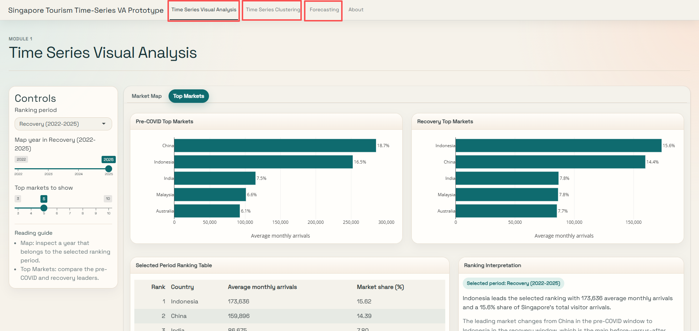
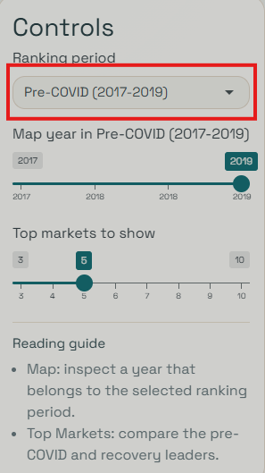
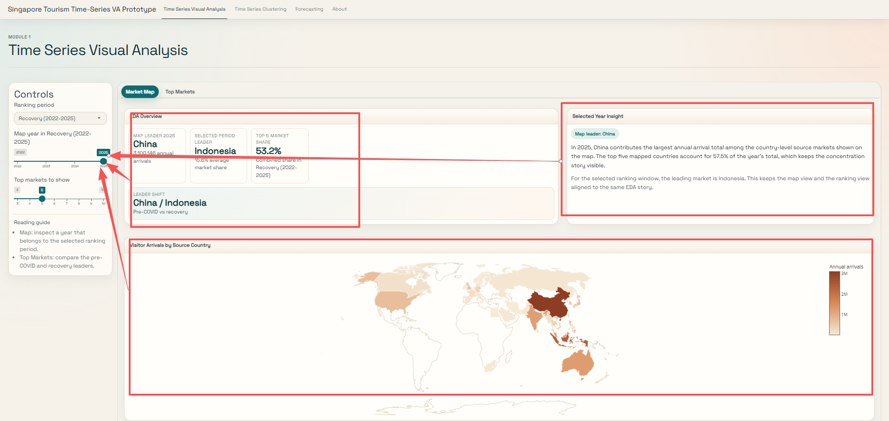
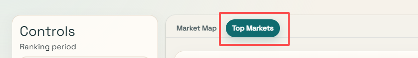

## Purpose

The purpose of this user guide is to provide users with a clear understanding of the system’s interface, features, and functions. It explains how to navigate between modules and sub-modules, use the available controls, and interpret the visual outputs presented in the dashboard. This guide is intended to help users operate the system efficiently and make effective use of its analytical capabilities.

## User Guide - General

 Users can navigate to different modules using the options boxed at the top of the page.

## User Guide - Time Series Analysis (Module 1)

**Step 1 - Period Selection** 

 

From the Controls Panel The User can select the period range that they want to check on, there will be three options available; First - Pre-covid 2017 \<-\> 2019 \| Second - COVID shock 2020 \<-\> 2021 \| Lastly - Recovery 2022 \<-\> 2025.

Base on the period selected The **slider** for Time(Year) Range will be available for user to slide around and check what are the different information. For Example, EDA Overview, Insight and Visitor Arrival By Source Country. As shown in the image below

**Step 2 - Slider for Time Range**

NEXT

**Step 3 - Navigation**

Users can also switch between sub-modules within a module by using the navigation buttons highlighted above.

**Step 4 - Top Market Slider**

Moving On to the Top Market Sub-Module. Users can adjust the number of top markets displayed by dragging the “Top markets to show” slider. The selected number will update the charts and ranking table accordingly.
